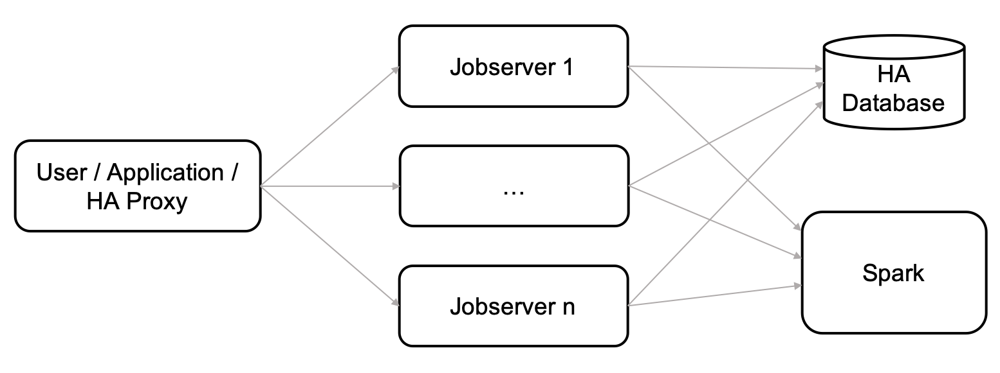

<!-- START doctoc generated TOC please keep comment here to allow auto update -->
<!-- DON'T EDIT THIS SECTION, INSTEAD RE-RUN doctoc TO UPDATE -->
**Table of Contents**  *generated with [DocToc](https://github.com/thlorenz/doctoc)*

- [Jobserver HA](#jobserver-ha)
  - [Architecture](#architecture)
  - [Setup](#setup)
    - [Prerequisites](#prerequisites)
        - [Cluster mode](#cluster-mode)
        - [HA database(s)](#ha-databases)
        - [External restart mechanism](#external-restart-mechanism)
    - [Configuration](#configuration)
        - [HA DAOs](#ha-daos)
        - [Split brain resolver (SBR)](#split-brain-resolver-sbr)
        - [Jobserver settings](#jobserver-settings)
  - [Limitations](#limitations)
  - [Experiences](#experiences)

<!-- END doctoc generated TOC please keep comment here to allow auto update -->

# Jobserver HA
To achieve high availability demands with jobserver it is possible to set up multiple jobservers for a failover.
This documentation explains the architecture, setup and limitations of the current Jobserver HA implementation.

## Architecture
The main idea is to run multiple jobservers in parallel, for example running on different VMs in the same network.
All jobservers run in an active-active setup, meaning every jobserver is able to serve any request and information is shared across all jobservers, by sharing one common (HA) database.
It is worth noting that internally certain (context) operations are forwarded and handled exclusively by a singleton on one of the jobservers (see [the initial proposal](https://github.com/spark-jobserver/spark-jobserver/issues/1236)), but to the outside every jobserver is able to serve any request.

Depending on the usage of jobserver, the end-user or an application that uses the jobserver can then freely route requests to any of the jobservers, retry requests on a different jobserver in case of a failure of one jobserver or even implement load-balancing. It might make sense to have an HA proxy for such purposes.



For more information about the setup, see also [this](https://github.com/spark-jobserver/spark-jobserver/issues/42) and [this](https://github.com/spark-jobserver/spark-jobserver/issues/1236) issue for discussions about HA motivation and realization.

## Setup
### Prerequisites

##### Cluster mode
Each jobserver has to be run in cluster mode to support HA. You can refer to [this documentation](cluster.md) to find information about how to set up jobserver in cluster mode.

##### HA database(s)
The database layer in which binaries and metadata of the jobserver are stored should be highly available as well. Currently there is an HA DAO implementation available for a combination of HDFS (for binaries) and Zookeeper (for metadata), see [HA DAO configuration](#ha-dao).

##### External restart mechanism
There needs to be a third-party entity that monitors the JVMs of the running jobservers and brings them back up again in case of termination. This is important not only to restore HA conditions in case of a failure, but also because the split brain resolver of jobserver in cluster mode might shutdown JVMs during network splits to avoid split brain situations.

### Configuration
##### HA DAOs
All jobservers in the HA setup need to be configured to use a common HA database.
By implementing the `BinaryDAO` and `MetaDataDAO` interfaces, you can enable any arbitrary database to store your binary and metadata information. For example you can use the combination of (already existing) HDFS DAO (for binaries) and Zookeeper DAO (for metadata) by including this in the `spark.jobserver` section of your config:
```
jobserver {
    daorootdir = "/tmp/spark-jobserver"
    binarydao {
        class = spark.jobserver.io.HdfsBinaryDAO
        dir = "hdfs://<hadoop-ip>:<hadoop-port>/spark-jobserver/binaries"
    }
    metadatadao {
        class = spark.jobserver.io.zookeeper.MetaDataZookeeperDAO
    }
}
```
For more information and configuration options please refer to the [DAO setup page](dao-setup.md#hdfs-+-zookeeper).

##### Split brain resolver (SBR)
All jobservers need to be configured to use a proper split brain resolver to resolve network splits and termination of members in the akka clusters. You can use the built-in `KeepOldestDowningProvider` as a split-brain-resolver by including this in your config:

```
akka {
  cluster {
    auto-down-unreachable-after = off
    downing-provider-class = "akka.downing.KeepOldestDowningProvider"
  }
}
```
For more information and configuration options please refer to the [jobserver split brain documentation](splitbrain.md#setting-up-split-brain-resolver).

##### Jobserver settings
The only remaining configuration is to familiarize all jobservers with each other. You can do this by including a list of jobserver addresses in the `spark.jobserver.ha.masters` section of your config:

```
ha {
    masters = ["<jobserver1-ip>:<jobserver1-akka-port>", "<jobserver2-ip>:<jobserver2-akka-port>"]
    # e.g. masters = ["1.2.3.4:2552", "1.2.3.5:2552"]
}
```
Make sure to have the identical order of jobserver addresses on every jobserver. These are used as seed nodes to join the akka cluster during startup.
The first jobserver in this list is the only that is allowed to create a new cluster on his own after he fails to join the cluster at any other member in this list (or possibly running drivers). Every other jobserver will continuously try to connect to any of the other nodes.
This is necessary to avoid the possibility of creating separate clusters during an initial and simultaneous startup of two jobservers.

## Limitations
Current limitations of jobserver HA are:
* **It takes time until the SBR removes a failing jobserver from the cluster** (default 20s). If the to-be-removed jobserver is the oldest member and therefore hosts the singleton, all AkkaClusterSupervisor operations (basically all context operations) during that time will fail. This means **20s of a degraded functionality**, in which context requests can time out and fail.
* As we don't use any additional software for resolving Akka network conflicts, the SBR always has a problem when there are only 2 nodes in the Akka cluster and they both see each other as unreachable. Meaning that each time we have only two Jobservers/two drivers/driver+Jobserver in the cluster, downing one of the nodes may down the second one as well. This means an HA setup with **two jobservers** still has scenarios that **can have downtime**.

## Experiences
The architecture explained in this documentation has been tested with the following setup:
* Spark Standalone Mode
* Two jobservers
* HDFS binary and Zookeeper metadata DAOs
* Monit as an external entity to restart terminated jobserver JVMs
