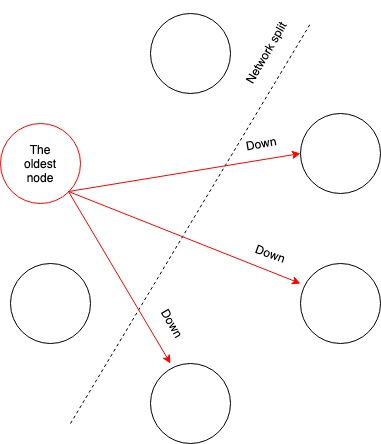
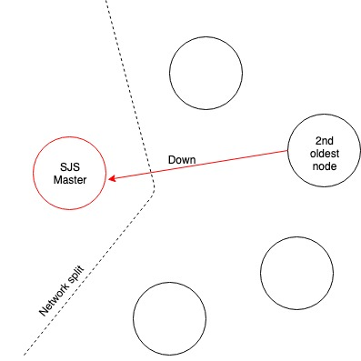
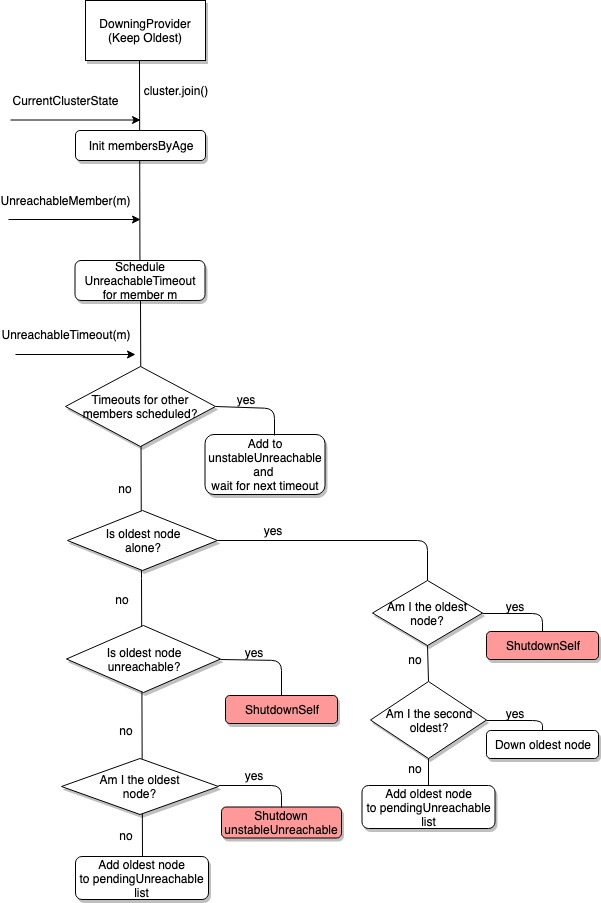
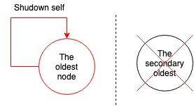

<!-- START doctoc generated TOC please keep comment here to allow auto update -->
<!-- DON'T EDIT THIS SECTION, INSTEAD RE-RUN doctoc TO UPDATE -->
**Table of Contents**  *generated with [DocToc](https://github.com/thlorenz/doctoc)*

- [Introduction](#introduction)
- [Problem statement for Jobserver](#problem-statement-for-jobserver)
- [Split brain implementation in Jobserver](#split-brain-implementation-in-jobserver)
- [Additional information](#additional-information)
  - [Setting up split brain resolver](#setting-up-split-brain-resolver)
  - [Details of implementation and decision tree](#details-of-implementation-and-decision-tree)
  - [Cluster of 2 nodes (SJS + SJS, SJS + Context, Context + Context)](#cluster-of-2-nodes-sjs--sjs-sjs--context-context--context)

<!-- END doctoc generated TOC please keep comment here to allow auto update -->

# Introduction

When operating an Akka cluster you must consider how to handle network partitions (a.k.a. split brain scenarios)
and machine crashes (including JVM and hardware failures). This is crucial for correct behavior if you use
Cluster Singleton or Cluster Sharding, especially together with Akka Persistence.

When there is a crash, we would like to remove the affected node immediately from the cluster membership.
When there is a network partition or unresponsive process we would like to wait for a while in the hope that
it is a transient problem that will heal again, but at some point, we must give up and continue with the nodes
on one side of the partition and shut down nodes on the other side. Also, certain features are not fully
available during partitions so it might not matter that the partition is transient or not if it just takes
too long. Those two goals are in conflict with each other and there is a trade-off between how quickly we
can remove a crashed node and premature action on transient network partitions.

More general information about split brain scenarios and problems can be found [here](https://doc.akka.io/docs/akka-enhancements/current/split-brain-resolver.html).


# Problem statement for Jobserver

It is very important for the Jobserver to recognize split brain scenarios and down unreachable nodes as soon
as possible. The proposed solution tried to address the following concerns:
1. A Jobserver master should be downed and removed from the cluster if only Jobserver is unreachable. Drivers
should continue to execute jobs.
2. If one or several drivers become unreachable, but the Jobserver master and some other drivers are still running,
then unreachable drivers should be removed from the cluster (in case of supervised cluster mode, we would
prefer to make sys.exit(-1) to allow Spark to restart the driver).
3. If possible, it is better if the Jobserver makes the decision (Cluster Singleton runs by default
on the Jobserver master node and in many cases the drivers have a shorter lifetime).

Please note, that the split brain resolver should recognize and resolve (down unreachable nodes) connection problems,
but the split brain resolver is not able to restart downed nodes. For this, you need to have
some external monitoring, which will restart the Jobserver in case the process is not running anymore.
The only case in which the system is able to recover itself without additional external help is, if contexts
are downed in supervised cluster mode. In this case, Spark will take over and restart the contexts.

# Split brain implementation in Jobserver

There are different approaches to solve this problem, but taking into account listed prerequisites the
preferred strategy is the one called [keep the
oldest](https://doc.akka.io/docs/akka-enhancements/current/split-brain-resolver.html#keep-oldest).

In this strategy, the oldest member of the cluster is responsible for downing unreachable members.
In the implementation of the split brain for the Jobserver a preferred role for the oldest member can be set, but
if there is no member of such role present in the cluster, the oldest member among all cluster members
fulfills its duty.
Cluster members, which are separated from the oldest node due to network split, trigger a self shutdown.



By default, the preferred role is set to the Cluster Singleton role, which runs on the Jobserver master machine.
The implementation is also using `down-if-alone` feature by default (there is no way to switch it on/off). This way,
if only the Jobserver master becomes unreachable, it will be removed by the second oldest node in the cluster
(one of the contexts) and no Spark job will be interrupted.



# Additional information

## Setting up split brain resolver

To start using the split brain resolver, please add the following settings to your configuration:

```
akka {
  cluster {
    auto-down-unreachable-after = off
    downing-provider-class = "akka.downing.KeepOldestDowningProvider"
  }
}
```

Additional settings can be changed by modifying the `custom-downing` section:

```
custom-downing {
  stable-after = 10s
  down-removal-margin = 5s

  oldest-auto-downing {
    preferred-oldest-member-role = ${akka.cluster.singleton.role}
  }
}
```

## Details of implementation and decision tree

The split brain resolver implements the DowningProvider interface from Akka. The instance of this split brain resolver
actor is created as a child of the core cluster daemon during the cluster startup. Each instance of the split brain
resolver maintains several lists in its actor state:
- All members of the cluster sorted by age (membersByAge)
- If a member is not in charge of downing unreachable members, it maintains a list of nodes that should be
removed by the oldest node (pendingUnreachable)
- List of unreachable members for which countdown till downing is triggered (scheduledUnreachable)
- List of members to be removed once timeout passed for all unreachable nodes (unstableUnreachable)

Following diagram clarifies Downing Provider decision process:


# Known problems

Current split brain resolver strategy tries to cover Jobserver workflow as optimal
as possible, but due to lack of communication in a split brain scenario for every
strategy there are some scenarios that will make suboptimal decisions.

## Cluster of 2 nodes (SJS + SJS, SJS + Context, Context + Context)

A cluster of two nodes is a slightly specific case, because the oldest node always shuts itself down if it is left
alone in the cluster (all other members become unreachable). On the other side of the network split, the oldest
node will be downed by the second oldest node.
This leads to the situation, when there are only two members in the cluster and the second oldest node
becomes unreachable/goes down, then the oldest node will also restart itself. This may create a temporary
downtime in the Jobserver work (during the time of restart) and also (in the current implementation) and lead
to the slave being killed with ERROR state in cluster mode.




